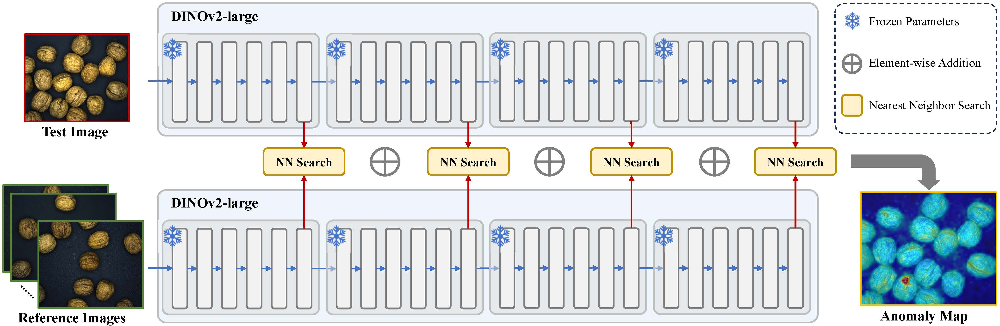

# VAND2025 Challenge - Track 1 Submission

## Overview

This is the official implementation of **SuperAD**, a submission to the **CVPR 2025 VAND3.0 Challenge Track 1: Adapt & Detect: Robust Anomaly Detection in Real-World Applications**.

**Challenge Website:** 
[https://sites.google.com/view/vand30cvpr2025/challenge](https://sites.google.com/view/vand30cvpr2025/challenge)

## Architecture

> The architecture of our method is illustrated below: 

<p align="center">
  
</p>

## 1. Dataset Preparation

We use the recently released **MVTecAD2 dataset**, which features:
- Significant lighting variations
- Highly variable anomaly locations

These characteristics make it extremely challenging and push the upper limits of anomaly detection methods.

- **Paper**: [The MVTec AD 2 Dataset: Advanced Scenarios for Unsupervised Anomaly Detection](https://arxiv.org/abs/2503.21622)
- **Dataset Download**: [MVTec Anomaly Detection 2 Dataset](https://www.mvtec.com/company/research/datasets/mvtec-ad)

---

## 2. Environment Installation

Create a new conda environment:
```bash
conda create -n superad python==3.8
conda activate superad
````

Install the necessary packages:

```bash
cd SuperAD
pip install -r requirements.txt
```
---

## 3. Inference

**No training is required in our method.**

To test and evaluate the model on the `Test_public` dataset:

```bash
python test_public.py --data_root /path/to/your/mvtec_ad_2
```

We use **binarization thresholds** corresponding to the **highest F1 scores** on the `Test_public` dataset to guide binarized image generation on:

* `Test_private`
* `Test_private_mixed`

To generate binarized images:

```bash
python test_private.py --data_root /path/to/your/mvtec_ad_2
```

If you encounter any problem when running test_private.py, use the pretested default threshold file:

```bash
./pretested_threshold/metrics_seed=0.json
```
Replace the path in detection.py line 434 with the one above.

We use **DINOv2-ViT-L-14** as the default backbone for feature extraction. To use another backbone:

* Visit the [DINOv2 repository](https://github.com/facebookresearch/dinov2) to download it.

---

## 4. VAND3.0 Challenge Submission

To reproduce the final results submitted to the benchmark server, use the shell script: 

```bash
sh ./VAND2025_track1_MAD2_reproduce_final_result.sh
```
---